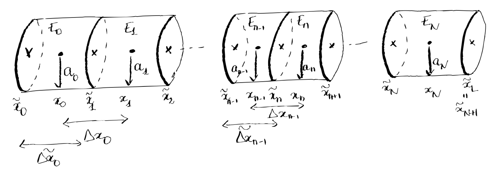
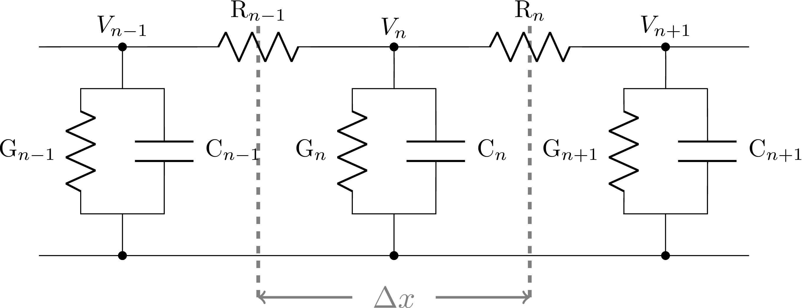
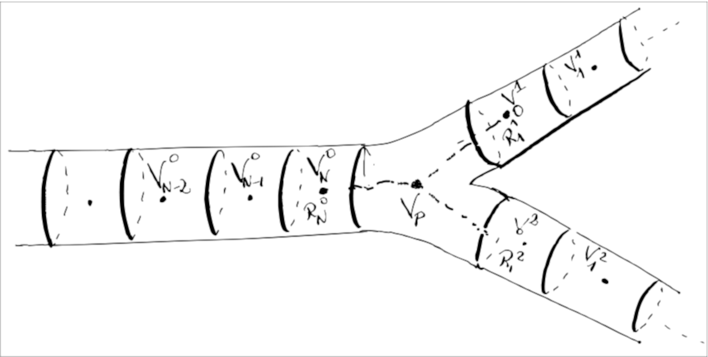

Model Description
-----------------

To model voltage propagation and ionic electrodiffusion in the *Sinaps*
python package, we consider the Cable equation [1] for voltage
dynamic, coupled to the Nernst-Planck equation for ionic dynamic.\
The Cable equation makes an analogy between the dendritic tree, and a
electric wire composed of RC circuits:

$$c \frac{\partial  V}{\partial t} = I^G + \frac{1}{R} \frac{\partial^2 V}{\partial x^2}.$$

In this model, the axonal membrane acts as a capacitor (capacitance
$c$), in parallel with voltage-dependent conductors accounting for ionic
channels (currents $I^G$). The voltage propagation is represented by a
resistive current: the current transported by electrons in the solid
structure of the wire follows Ohm's law (current $I = \frac{U}{R}$). This model assumes a zero extracellular potential. There are a priori no restrictions on membrane currents.\
To infer calcium dynamics from voltage propagation, we couple the
previous equation to the Nernst-Planck equation, for ionic
electrodiffusion. This equation describes the motion of charged species
within an electrolyte [2], and is build from the first principle
of mechanics, stating the conservation of ions. We add to this equation
the flux of ions coming from the channels, as well as the variation of
concentration due to the eventual chemical reactions. We get:

$$\label{NP}
\frac{\partial c^i}{\partial t} = - \nabla \cdot j^i + j^{i,\text{m}} + \gamma^{i,\text{chem}} \;\; \forall i \in \text{\{ions\}}$$

The flux of charge per surface area $j_i$ \[mol.s$^{-1}$.m$^{-2}$\],
sums the diffusion flux of ionic species derived from Fick's law
$j_{diff}^i = - D_i \nabla c_i$, and an electric flux representing the
motion of ions due to the electric field:
$j_{\text{elec}}^i = - \frac{D_i z_i e c_i}{k_b T} \nabla V$
[2,3]. $\displaystyle \frac{D_i z_i e c_i}{k_b T}$ is the
Einstein relation for the mobility of ion species: $D_i$ is the
diffusion coefficient of species $i$, $z_i$ the valence of species $i$,
$k_B T$ the thermal energy and $e$ is the electric charge [3]. We
get:

$$j^i = j_{diff}^i + j_{\text{elec}}^i = - D_i \nabla c^i  - \frac{D^i z^i e c^i}{k_b T} \nabla V.$$

$j^{i, \text{m}}$ represents the lineic flux of ions entering from the
channels \[mol.s$^{-1}$.m$^{-1}$\]. $\gamma^{i,\text{chem}}$ represents
the variations of concentration due to the eventual chemical reactions.

Notations
---------

In one branch going between $\tilde{x}_0 \leq x \leq \tilde{x}_L$, we
consider different positions
$\tilde{x}_0 < \tilde{x}_1<...< \tilde{x}_n <...< \tilde{x}_N < \tilde{x}_{N+1} = \tilde{x}_L$.
We then define $x_n$ as the middle point between $\tilde{x}_n$ and
$\tilde{x}_{n+1}$ (see Fig. [1]). Finally, we define the elementary domains
$E_n$, $n = 0..N$, with boundaries $\tilde{x}_n$ and $\tilde{x}_{n+1}$.
The domains $E_n$ are portions of cylinders, with radius $a_n$, centered
around $x_n$, with length
$\tilde{\Delta x_n} = \tilde{x}_{n+1} - \tilde{x}_n.$ We also define
$\Delta x_n = x_{n+1} - x_n.$

Our goal is to compute the potential $V_n$ and the concentration of each
ionic species $i$, $c_n^i$, at each point $x_n$.

<figcaption>Fig. 1: <b>Discretization of one branch.</b> The potential and the concentrations
are evaluated at each point $x_n$ in the
branch.</figcaption>  
 

Derivation of the discretized Cable equation in branches 
--------------------------------------------------------

We derive the discretized Cable equation for voltage dynamics along one
branch. We evaluate the potentials $V_n$, $n = 0..N$ at each point
$x_n$. The propagation of voltage in each elementary domain $E_n$ is
modeled using an analogy with a RC electrical circuit:

<figcaption>Fig. 2: <b>Analogy with a RC electrical circuit.</b> Each elementary domain of
size $\tilde{\Delta x}$ contains a capacitor and a conductor to account
for the capacitive and conductive properties of the
membrane.</figcaption>  
 

The axonal membrane behaves as a capacitor, and generates a current

$$\displaystyle I_n^C =C_n \frac{d V_n}{dt},\;\;\; 0 \leq n \leq N,$$

where $C_n$ represents the capacity of the membrane in domain $E_n$.
This capacitor is in parallel with voltage-dependent conductors to
account for the active channels present on the membrane, that will be
denoted by

$$\displaystyle I_n^G(t) = 2 \pi a_n \tilde{\Delta x_n}  I^G(t, V_n)\;\;\; 0 \leq n \leq N$$

where $I^G(t, V_n)$ is the membrane current in $E_n$ (in $A.m^{-2}$).\
Finally, the voltage propagation from $E_{n-1}$ to $E_{n}$ and from
$E_{n+1}$ to $E_{n}$ are represented by the resistive currents
$I_{n-1}^R$ and $I_{n}^R$ such that

$$\displaystyle I_{n}^R = \frac{1}{R_{n}}\left(V_{n} - V_{n-1} \right)\;\;\; 1 \leq n \leq N-1,$$

where $R_{n}$ is the cytoplasmic resistance in domain $E_{n}$.\
The electrical components $R_n$ and $C_n$ are derived using standard
computation of the resulting capacitance and conductance in a cylinder.
The membrane capacitance $C_n$ (in $\text{Farad}$) is given by:

$$\begin{aligned}
C_n = c_n 2 \pi a_n \tilde{\Delta x_n}\end{aligned}$$ 

where $c_n$ is the
permittivity of the membrane in domain $E_n$ (in
$\text{F}.\text{cm}^{-2}$).\
The cytoplasm axial resistance $R_{n-1,n}$ (in $\Omega$) from domain
$E_{n-1}$ to $E_n$ is: 

$$\begin{aligned}
R_{n} = r_{n} \frac{\Delta x_{n}}{\pi a_{n}^2}\end{aligned}$$ 

where
$r_{n}$ is the cytoplasmic electrical conductance
($[\Omega . \text{cm}]$) in domain $E_{n}$.\
Using Kirchhoff's current law in position $x_n$, we get:

$$I_n^C - I_n^G - I_{n-1}^R + I_{n}^R =0.$$

Replacing the currents with their formulas in the previous equation, we get the discretized Cable
equation for the dynamics and propagation of voltage in domain $E_n$:

$$\begin{aligned}
\label{eqCable}
C_n \frac{d V_n(t)}{dt} = I_n^G(t) + \frac{V_{n} -  V_{n-1}}{R_{n-1}} - \frac{V_{n+1} - V_n}{R_{n}}.\end{aligned}$$

At the tip of the branch, the currents $I_0 = 0$ and $I_N = 0$. Hence,
Kirchoff's law rewrites:

$$I_k^C - I_k^G - I_{k}^R =0\;\;\; \text{for } k = 1,N.$$

The equation becomes:

$$\begin{aligned}
&C_1 \frac{d V_1(t)}{dt} = I_1^G(t) - \frac{V_{2} -  V_{1}}{R_{1}}\\
&C_{N} \frac{d V_{N}(t)}{dt} = I_{N}^G(t) + \frac{V_{N} -  V_{N-1}}{R_{N-1}}\end{aligned}$$

If the radius $a_n$, the length $\Delta x_n$, the cytoplasmic electric
conductivity $r_n$ and the membrane permittivity $c_n$ are independent
of $n$ along the branch, i.e. $a_n = a$, $\Delta x_n=\Delta x$,
$r_n = r$ and $r_n = r$ for all $n$ in the branch, we recognize the
discretized form of the Cable equation:

$$\begin{aligned}
\label{MSeq_tip}
c \frac{\partial  V}{\partial t} = I^G + \frac{a}{2 r} \frac{\partial^2 V}{\partial x^2},\end{aligned}$$

with reflective boundary condtions at the tips $x = 0$ and $x = L$:

$$\begin{aligned}
\frac{\partial V}{\partial x}(t,0) = 0\\
\frac{\partial V}{\partial x}(t,L) = 0\end{aligned}$$

Derivation of the discretized Cable equation at junctions
---------------------------------------------------------

<figcaption>Fig. 3: <b>Strategy at branches junction.</b> We introduce a virtual point $x_p$,
in the middle of the junction, where we evaluate the potential
$V_p$.</figcaption>  
 

To derive the discretized equation at the junction between three
branches, we introduce a virtual point $x_p$ in the middle of the
junction. We consider that the junction is located at the
end of branch $0$, and at the start of branch $1$ and $2$ (see
Fig. [3]). We define the resistive current between the point $x_N^0$, the last point
in branch $0$, and $x_p$. The same way between $x_1^1$ and $x_1^2$, the
first points of branches $1$ and $2$ respectively and $x_p$. We obtain:

$$\begin{aligned}
I_N^{0,R} &= \frac{V_p - V_N^0}{R_N^0}\\
I_1^{1,R} &= \frac{V_1^1 - V_p}{R_1^1}\\
I_1^{2,R} &= \frac{V_1^2 - V_p}{R_1^2}\end{aligned}$$

Using Kirchhoff's law at point $x_p$, we get
$I_N^{0,R} - I_1^{1,R} - I_1^{2,R} = 0$, and hence

$$V_p  = \frac{V_N^0/R_N^0 + V_1^1/R_1^1 + V_1^2/R_1^2}{1/R_N^0 + 1/R_1^1 + 1/R_1^2}$$

Finally, we get the equations for $V_N^0$, $V_1^1$ and $V_1^2$ using
Kirchoff's law at points $x_N^0$, $x_1^1$ and $x_1^2$. Follows the
example for $V_N^0$:

$$C_N^0 \frac{d V_N^0(t)}{dt} = I_N^{G,0}(t) + \frac{V_{N}^0 -  V_{N-1}^0}{R_{N-1}} - \frac{V_p - V_N^0}{R_N^0}.$$

This set of coupled linear equations for the voltage is then solved
using the BDF solver.

Derivation of the discretized Nernst-Planck equation
----------------------------------------------------

Using the same formalism as before, we discretize the Nernst-Planck
equation. To simplify the notations, we will consider in this section
that the radius is constant, even though the code supports variations in
the radius along the branches. In each elementary domain, for each ionic
species $i$, we solve the equation for the concentration dynamic $c_n^i$
with the discretized flux:

$$\begin{aligned}
\frac{\partial c_n^i}{\partial t} = - \frac{j^i_{n+1} - j_n^i}{\tilde{\Delta x_n}} + \frac{2 j_n^{i, \text{m}}}{a_n} + \gamma_n^{i, \text{chem}}\end{aligned}$$

where:

$$ j_n^i = - D_n^i \frac{c_n^{i} - c_{n-1}^i}{\tilde{\Delta x_n}} - \frac{D_n^i z^i e}{k_B T} c_n^i \frac{V_{n} - V_{n-1}}{\tilde{\Delta x_n}}. $$

$j_n^{i,m}$ is the flow of ions of species $i$ coming from channels (in
\[mol . s$^{-1}$\]), that is define within the channel class.  
The chemical flux $\gamma_n^{i, \text{chem}}$ will be
described in the next section.

Implementation of chemical reactions 
------------------------------------

The model equation for chemical reactions is the classical chemical
equations. Considering the reaction 

$$ \require{mhchem}
\begin{aligned}
\sum_{i = 1}^n \alpha_i \text{A}_i \xrightleftharpoons[\mathbf{k_{b}}]{\mathbf{k_{f}}} \sum_{i = 1}^m \beta_i \text{B}_i, 
\label{eqChem}\end{aligned}$$ 

between ionic species $A_i$, $i = 1,...,n$
and $B_i$, $i = 1,..,m$, we compute in each elementary domain $E_n$ the
reaction speeds: 

$$\begin{aligned}
v^f_n &= \displaystyle k_f \prod_{i = 1}^n \left(c_n^{A_i}\right)^{\alpha_i}\\
v^b_n &= \displaystyle k_b \prod_{i = 1}^m \left(c_n^{B_i}\right)^{\beta_i}.\end{aligned}$$

The variation of concentration of each species, due to the chemical reaction inside $E_n$ is then:

$$\gamma_n^{A_i,\text{chem}} = \alpha_i (v_n^b - v_n^f)$$ 

for the reactants $A_i$, and

$$\gamma_n^{B_i,\text{chem}} = \beta_i (v_n^f - v_n^b)$$ 

for the products $B_i$.

Bibliography 
------------

[1] Tuckwell HC, *Introduction to Theoretical Neurobiology*, Cambridge University Press, 1988

[2] Nernst W, *Zur Kinetik der in Lösung befindlichen Körper*, Zeitschr f Phys Chem 2, pp. 613-637, 1888 

[3] Kirby BJ, *Micro- and Nanoscale Fluid Mechanics*, Cambridge University Press, 2010 

