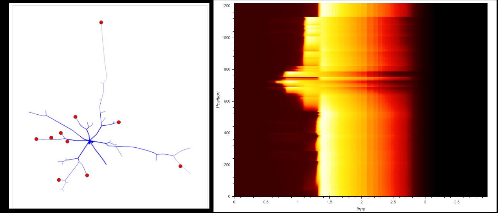

# Summary

How neuronal dendrites collect, process and transmit information? What is the role of neurons
specific geometry on neuronal activity? The old postulate that dendrites serve mainly to connect
neurons and to convey information, with no specific role in cognitive processes, is currently
challenged by the emergence of novel experimental techniques [London:2005,Basak:2018]. Hence, the
role of the dendritic tree in transforming synaptic input into neuronal output is now a leading
question in developmental neuroscience. In particular, using genetically-encoded Ca$^{2+}$-
indicators, state-of-the-art techniques have been developed to track the calcium dynamics within
the entire dendritic tree, at a high spacial and temporal scales [Sakaki:2020]. Tracking neuronal
activity through calcium dynamics is nevertheless ambitious. Calcium concentration fluctuations
are known to reflect neuronal activity in a very complex way, as ions can flow from many sources
that interact non-linearly with each other. There is thus an enhanced need for modeling to
resolve what can be seen as an inverse problem: finding from experimental recordings the markers
of synaptic activity, and distinguish in the calcium signals the different calcium sources. 

{width=50%}

# Statement of need

`Sinaps` is an easy-to-use Python library to simulate voltage propagation, ionic electrodiffusion and chemical reactions in neurons. It is based on the Cable equation for voltage propagation, coupled to the Nernst-Planck equation for ionic electrodiffusion. This library has been designed for neuroscience laboratories using both an experimental and a modeling approach. It includes the code to simulate voltage dynamic and ionic electrodiffusion, Hodgkin-Huxley type membrane channels, and chemical reactions. Templates to code custom reaction-diffusion mechanisms, as well as specific membrane channels are provided. We also provide the possibility to load a full morphometric geometry from data following [neuromopho.org](http://neuromorpho.org/) file type (swc file) \autoref{fig:volt}.

Numerous softwares has been designed to realize simulations of voltage propagation in neurons [Bower:1998,Carneval:2006]. While most of those softwares are using the simple Cable theory model, and are designed toward neuronal networks simulation, our Python library is designed to realize fast simulation of both voltage and ionic dynamics, taking into account electrodiffusion of ions at a fine spatial scale. We also choose to realize the code in Python, which has the advantage of having a code fully transparent with easy access to all the variables. The class structure renders the code easily editable. Hence, our library provides an easy way to simulate voltage and ionic dynamics, at the spacial scale reached by morphometric techniques, and at a temporal scales not yet available for \textit{in vivo} imaging of the full neuronal scale.

# Acknowledgements

This work was supported by the Fyssen foundation.

# References
